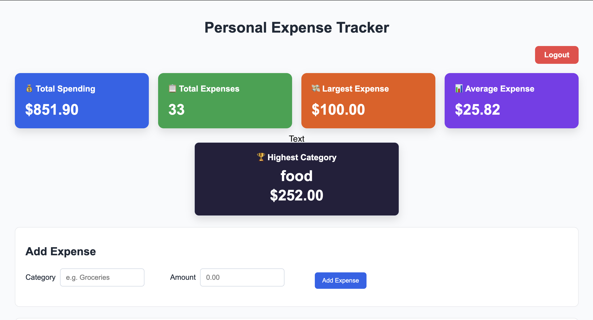
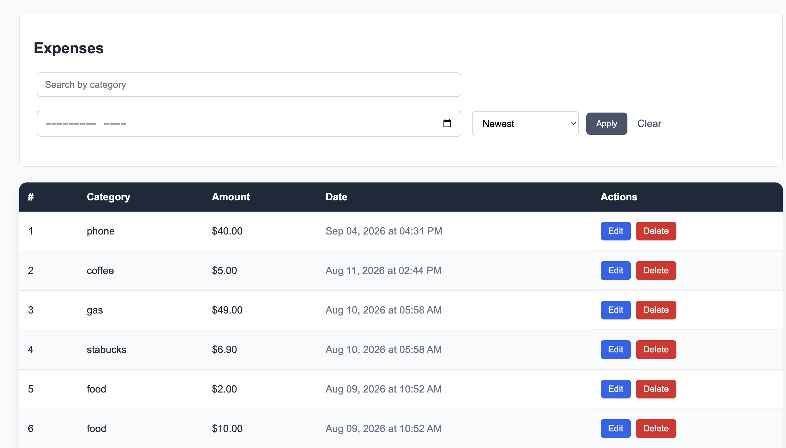
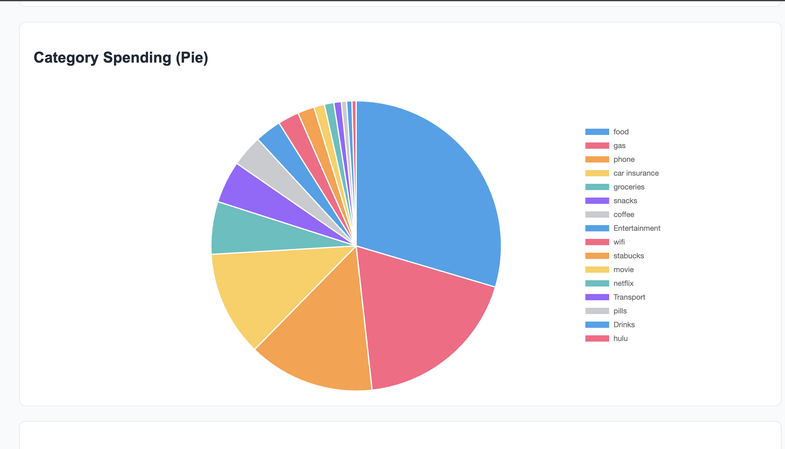

# Expense Tracker

A Flask web application for tracking personal expenses. Users can create an account, log in, manage their expenses, and view summaries of their spending.

## Features

- User registration and login
- Secure password hashing
- User-specific expense data
- Add, edit, and delete expenses
- Search expenses by category
- Filter expenses by month
- Sort expenses by date, amount, or category
- Pagination
- Dashboard with:
  - Total spending
  - Number of expenses
  - Largest expense
  - Average expense
  - Highest-spending category
- Spending-by-category chart
- Flash messages for user feedback

## Technologies Used

- Python
- Flask
- SQLite
- HTML
- CSS
- JavaScript
- Chart.js
- Werkzeug

## Running Locally

1. Clone the repository:

   ```bash
   git clone YOUR_REPOSITORY_URL

2. Go into the project folder:   
   cd expense-tracker

3. Install the required packages:
   pip install -r requirements.txt

4. Set a Flask secret key:
   export SECRET_KEY="your-secret-key"

5. Run the application:
   python app.py

## What I Learned
Through this project, I practiced building a complete web application with Flask and SQLite. I learned how to connect a web application to a database, implement CRUD operations, build authentication with sessions and password hashing, protect user-specific data, create dynamic SQL queries, validate user input, implement pagination, and organize a Flask project for deployment.

## Screenshots

### Dashboard


### Expense Management


### Spending Visualization


## Live Demo
https://noran8.pythonanywhere.com